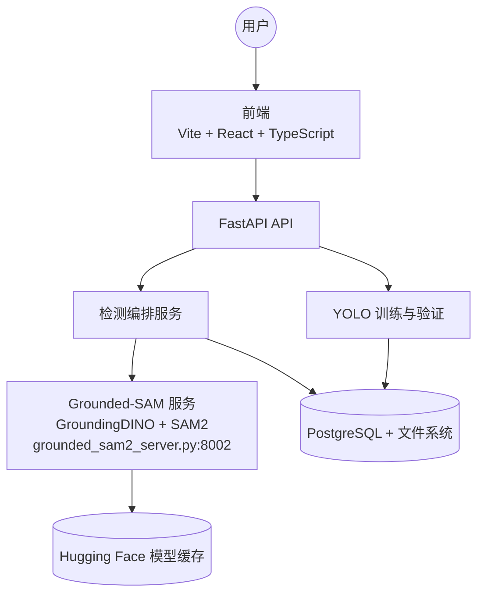
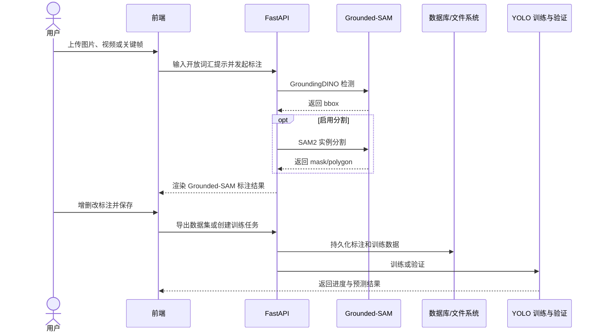

# AutoYOLO 项目架构设计图

AutoYOLO 是一个用于 Grounded-SAM 自动标注、人工校对和 YOLO 训练的全栈平台。自动标注链路统一为 GroundingDINO 文本检测加 SAM2 实例分割。

## 架构说明

### 前端

React 单页应用负责图片、视频和关键帧上传，Grounded-SAM 参数配置，Canvas 标注校对，数据集导出以及 YOLO 训练和验证。

### 后端

FastAPI 路由接收请求，检测服务编排 Grounded-SAM 调用并持久化结果；Repository 和 SQLAlchemy 负责结构化数据访问，文件系统保存媒体、标注和训练输出。

### Grounded-SAM 服务

`backend/grounded_sam2_server.py` 作为独立 HTTP 服务运行。GroundingDINO 根据开放词汇文本提示生成检测框，SAM2 根据检测实例生成 mask。关闭分割时返回检测框，不会切换到另一套模型。

### YOLO 闭环

人工修正后的 bbox 和 polygon 标注可导出为多种格式，并用于 YOLOv8、YOLOv11 或 YOLOv26 的检测/分割训练和后续验证。

## 核心业务流程

