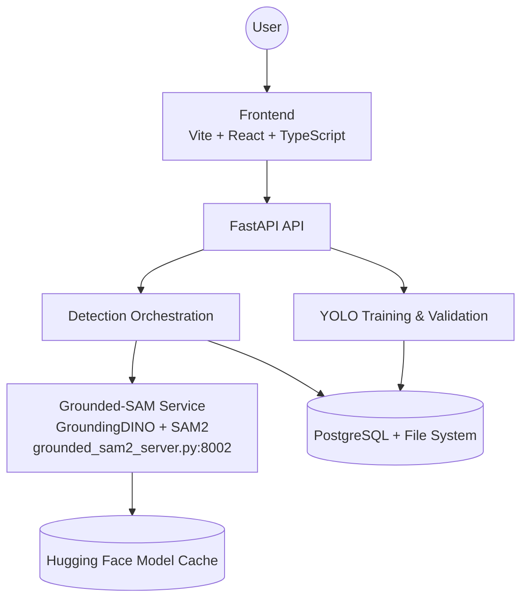
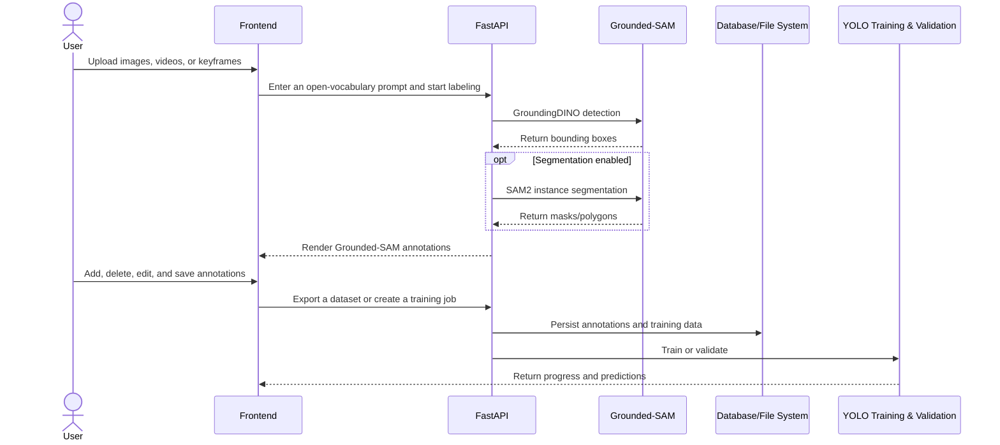

# AutoYOLO Architecture Design Diagram

AutoYOLO is a full-stack platform for Grounded-SAM auto-labeling, human refinement, and YOLO training. The annotation path is unified: GroundingDINO performs text-conditioned detection and SAM2 performs instance segmentation.

## Architecture Details

### Frontend

The React single-page application handles image, video, and keyframe uploads; Grounded-SAM settings; Canvas annotation refinement; dataset export; and YOLO training and validation.

### Backend

FastAPI routes receive requests, the detection service orchestrates Grounded-SAM inference and persists results, and repositories with SQLAlchemy handle structured data access. Media, annotations, and training outputs are stored on the file system.

### Grounded-SAM Service

`backend/grounded_sam2_server.py` runs as a standalone HTTP service. GroundingDINO generates bounding boxes from open-vocabulary text prompts, and SAM2 generates instance masks from those detections. Disabling segmentation returns boxes only; it does not select another model stack.

### YOLO Loop

Human-refined bounding boxes and polygons can be exported in multiple formats and used for YOLOv8, YOLOv11, or YOLOv26 detection/segmentation training and validation.

## Core Workflow

